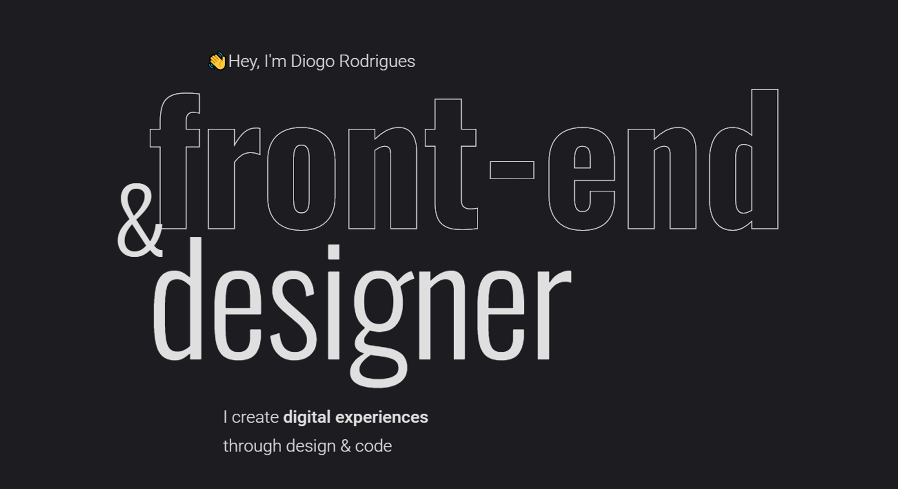

# My personal website (portfolio and blog)

[diogorodrigues.dev](https://www.diogorodrigues.dev/)

<!--  -->
Made with [GatsbyJS](https://www.gatsbyjs.org/) and hosted on [Netlify](https://www.netlify.com/). 💜

## Some features of this project:

- Multi-language (English and Portuguese)
- [React](https://reactjs.org/)
- [Gatsby](https://www.gatsbyjs.org/)
- [Netlify](https://www.netlify.com/)
- [GraphQL](https://graphql.org/)
- [Netlify CMS](https://www.netlifycms.org/)
- [Styled components](https://styled-components.com/)
- All important seetings for speedy and optimized images
- Focus on SEO
- PWA

---

I also developed this [Gatsby multi-language starter with CMS](https://github.com/diogorodrigues/iceberg-gatsby-multilang) that contains all features I'm using here. ✨👌🎉😎

---
